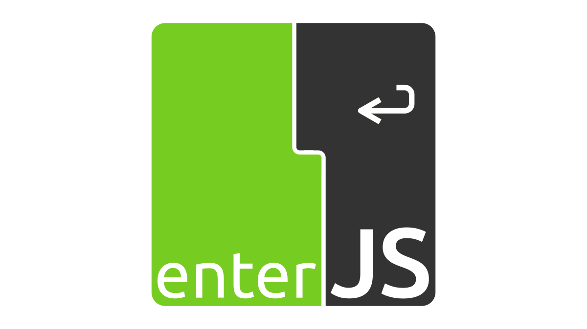

# Push-Based Angular Perf Workshop



## Installation Instructions

**System Requirements**

* `node 18`
* `npm 8`

**Clone and install**

```bash
git clone https://github.com/push-based/ws_enterjs_advanced_day_23.git

cd ws_enterjs_advanced_day_23
npm install

# (optional) if the step before didn't work, please try the following
npm install --force
```

**Run the application**

```bash
npm run start
```

## Workshop Information

[General Info](https://docs.google.com/document/d/1vDoBxysZTNXPlzAT8aWD61jrG9KxMbJ_YW9E56_xzlY)

[Slides](https://drive.google.com/drive/folders/1DuOk0mpPJImNjnE1f22WxIONrdRcpNHi)

## Exercises

// TODO 
