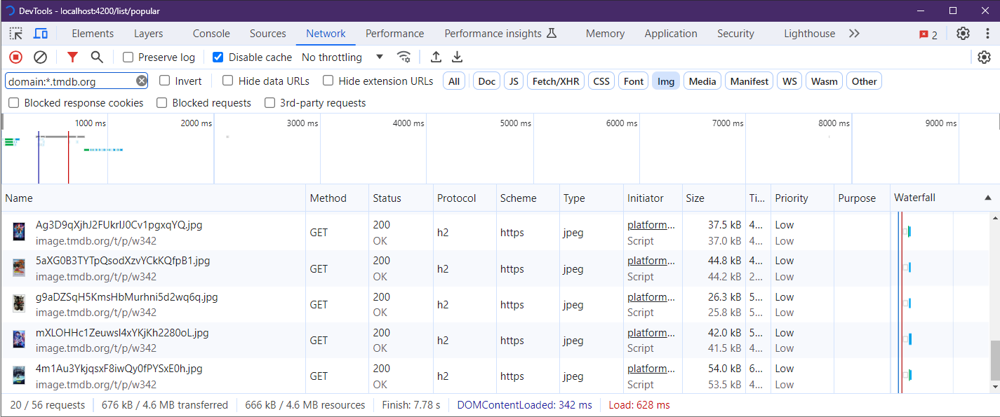
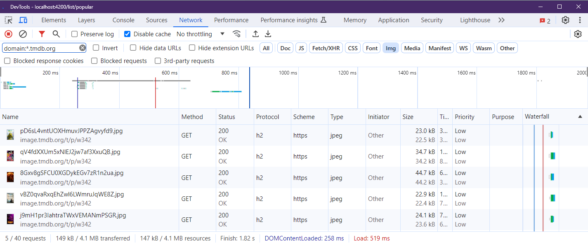
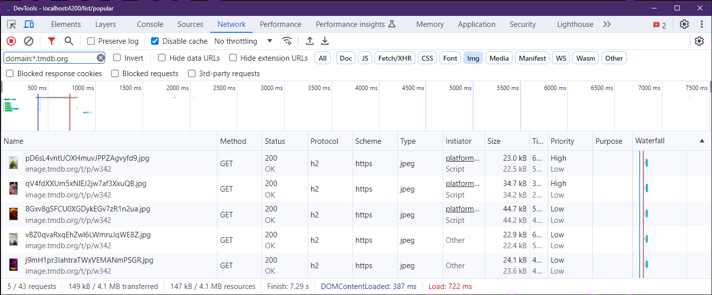

# Image lazy loading

If images are part of you application should understand what you can do to improve their loading time.

In this exercise you will learn how to use lazy loading techniques manually.

## Record the initial state

Go to network tab an look at how many images are bing loaded



## Use the `lazy` attribute

Your task is to improve the loading of all images in the movie-list. Using the `` attribute in the movie-card component.

<details>
    <summary>show solution</summary>

Go to `movie-card.component.html` and add the lazy attribute to the image tag.

```html
  
```
</details>

Now verify that the images where lazy loaded by checking how many images where initially loaded



We can improve this even more by telling the browser which images should load with priority. Add loading eager and priority high to the 2 initial images.
To do this you can pass the index to the movie card and set the loading attribute to eager on te first to images as well was the fetchpriority to high.

Start by passing the index to from the ngFor to the movie card

<details>
    <summary>show solution</summary>

Go to `movie-list.component.html` get the index from the ngFor and pass it to the movie card as an input.

```html
  <movie-card
  (selected)="navToDetail($event)"
  [movie]="movie"
  [index]="idx"
  *ngFor="let movie of movies;let idx = index">
  </movie-card>
```

And then set the loading and priority attributes in the `movie-card.component.html` 

```html
   2 ? 'lazy' : 'eager'"
       [attr.featchpriority]="index > 2 ? 'low' : 'high'"
  >
```
</details>

Great now verify that the loading eager and fetch priority high are being added to only the two first images



## Responsive images with srcset and sizes

As different screens need different resolutions we can make use of the provided image formats of our image server.

the provided formats are:
- 150w
- 185w
- 342w
- 500w
- 780w

this values will  be used as sizes.

```html
@TODO
```

the last missing information is the logic that determines when to use which set.

let's add src set and see what happens:

```html
sizes:"(min-width: 901px) 30vw, 70vw"
```

Use the debugging script to track the browser changes:

https://github.com/push-based/awesome-web-performance-snippets/tree/main/snippets/check-image-srcset

Now use the following values for sizes:

```html
sizes:"(min-width: 901px) 15vw, 42vw"
```

Debug it again and compare the results.
